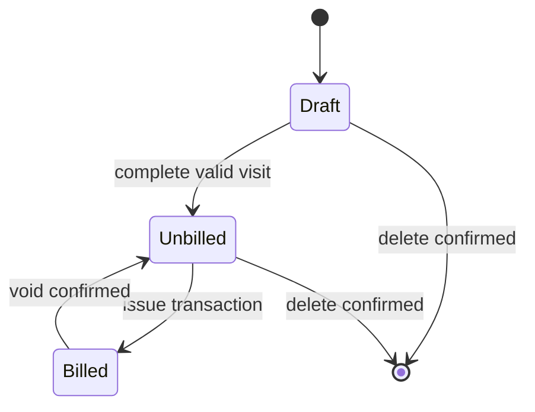
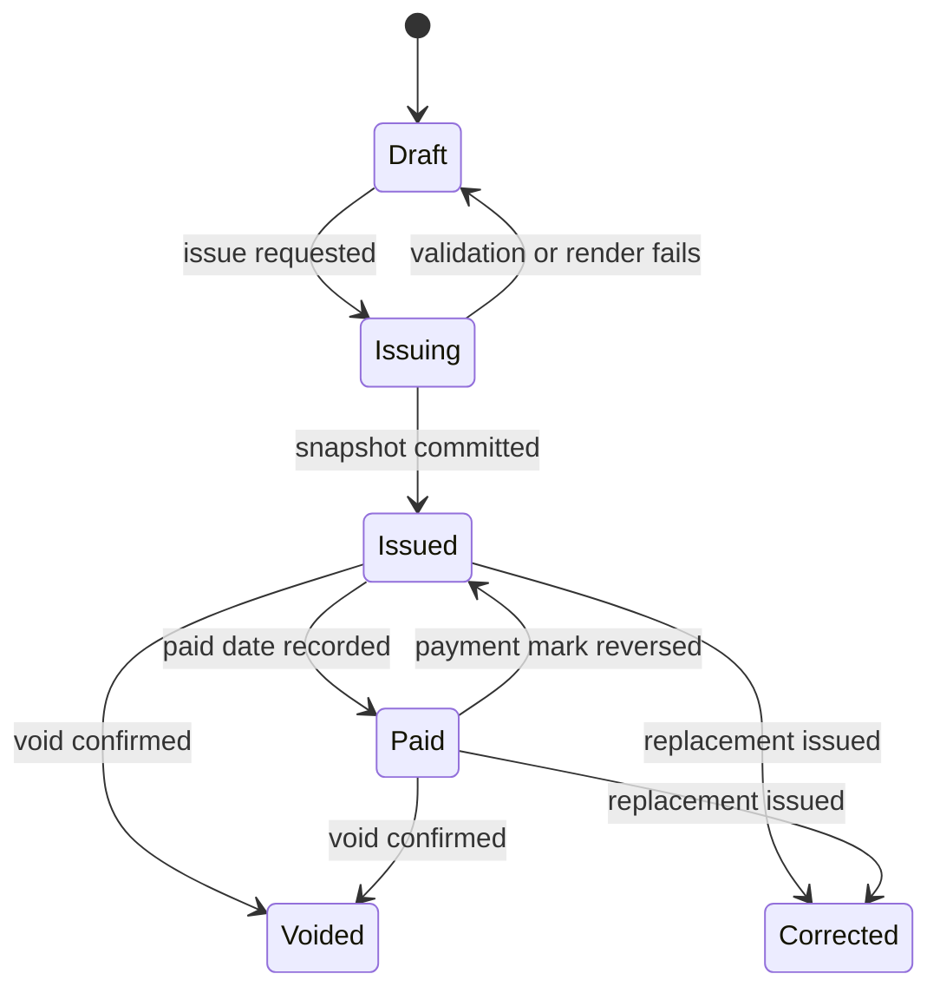

# 日付別請求書・作業明細 — Build Plan

**English:** Dated Service Invoice — Build Plan  
**Date:** 27 September 2026  
**Status:** `READY TO IMPLEMENT` for the locked launch scope  
**Implementation state:** Planning only; no application code has been created.

## Executive decision

Build a native, iPhone-only, offline-first app in SwiftUI. Keep all invoice rules in a presentation-independent Swift package, persist operational data in SQLite through GRDB, generate canonical A4 PDFs with `UIGraphicsPDFRenderer`, preview those exact bytes with PDFKit, and sell one lifetime Pro entitlement through StoreKit 2.

The implementation must be engine-first:

1. deterministic money, quantity, tax and numbering;
2. explicit visit and invoice state machines;
3. transactional persistence and recovery journal;
4. immutable issued snapshots and canonical PDF bytes;
5. verified backup/restore;
6. StoreKit entitlement gate;
7. plain diagnostic harness;
8. only then the six-screen production interface.

This architecture directly protects the product promise: several completed service visits become one correct, readable invoice without double billing, data loss, an account or a network connection.

## Locked platform contract

| Decision | Locked choice | Reason |
| --- | --- | --- |
| Product | 日付別請求書・作業明細 / Dated Service Invoice | Search-led Japanese name already selected. |
| Platform | iPhone App Store | The validated launch scope is iPhone, not iPad, Mac or web. |
| Minimum OS | iOS 17.0 | Supports the intended devices and modern SwiftUI/StoreKit APIs without widening the compatibility surface. |
| Reference device | iPhone SE (2nd generation), iOS 17 | Smallest supported viewport and a conservative performance device. |
| Language | Japanese by default; English selectable inside Settings | Japanese is the customer interface. English is the owner's control layer. |
| Data location | Local application container | No account, server, background sync or required connection. |
| Monetization | One non-consumable lifetime Pro purchase | No subscription, ads or paid data access. |
| Price | Japan target ¥2,000; display StoreKit's live localized price | The store price is authoritative and must not be hard-coded. |
| Release | Xcode Cloud automation; automatic App Store publication after Apple approval | Reproducible signed builds without long-lived local signing secrets. |

Use the latest stable, non-beta Xcode available when implementation starts. Record the exact Xcode build, Swift compiler, SDK and dependency resolutions in the first engine candidate manifest. Enable Swift 6 language mode and complete strict concurrency checking.

## Researched implementation choices

### Application and concurrency

- **SwiftUI** for the production shell and navigation.
- **Swift 6** strict concurrency.
- One app-owned persistence actor. Views and view models never execute SQL or calculate invoice totals.
- Unidirectional feature actions: a screen sends a command, the engine validates it, persistence commits it, and the screen observes the resulting state.
- Structured concurrency only. No detached task may own an invoice-issue operation.

### Persistence: GRDB over SwiftData

Use **GRDB 7.11.1**, pinned exactly through Swift Package Manager for the first build. Commit `Package.resolved`.

Why GRDB is the stronger fit:

- invoice numbering, snapshot creation, visit billing state and free-allowance consumption need one explicit SQLite transaction;
- schema constraints, indexes and migrations remain visible and reviewable;
- backup preflight and recovery can operate against a temporary database;
- the same repositories can run in an unstyled macOS command-line harness;
- the dependency is source-based, narrow and auditable.

SwiftData remains a valid Apple-native option, but its automatic model behavior is not the preferred tradeoff for this product's accounting-style invariants and long-lived migration tests.

GRDB is the only third-party runtime dependency approved for launch. Do not add analytics, networking, PDF, ZIP, logging, design-system or StoreKit wrapper SDKs.

### Apple frameworks

| Concern | Framework | Use |
| --- | --- | --- |
| Interface | SwiftUI | Six-screen native app shell and settings. |
| PDF creation | UIKit `UIGraphicsPDFRenderer` | Canonical deterministic PDF `Data`. |
| PDF preview | PDFKit | Display the exact generated/stored PDF bytes. |
| Purchase | StoreKit 2 | Product, purchase, entitlement observation and restore. |
| Export/import | SwiftUI `FileDocument`, `FileWrapper`, file importer/exporter | User-controlled document-package backup. |
| Integrity | CryptoKit SHA-256 | PDF and backup-file integrity hashes. |
| Logging | OSLog | Privacy-redacted operational diagnostics. |
| Localization | String Catalogs (`.xcstrings`) | Japanese source meaning and complete English control translation. |

## Proposed repository shape

This is the intended layout; it must not be created until implementation is authorized.

```text
Invoice/
├── App/
│   ├── InvoiceApp.swift
│   ├── Features/
│   ├── Localization/
│   └── Resources/
├── Packages/InvoiceEngine/
│   ├── Sources/
│   │   ├── InvoiceDomain/
│   │   ├── InvoicePersistence/
│   │   ├── InvoicePDF/
│   │   ├── InvoiceBackup/
│   │   ├── InvoiceEntitlements/
│   │   └── InvoiceHarness/
│   └── Tests/
│       ├── InvoiceDomainTests/
│       ├── InvoicePersistenceTests/
│       ├── InvoicePDFTests/
│       ├── InvoiceBackupTests/
│       └── InvoiceEntitlementsTests/
├── InvoiceUITests/
├── Fixtures/
│   ├── Calculations/
│   ├── PDFs/
│   ├── Backups/
│   └── Migrations/
├── ci_scripts/
└── docs/
```

## Module responsibilities

### `InvoiceDomain`

Pure Swift with no SwiftUI, SQLite, StoreKit, file-system or PDF imports.

- `Money`: signed `Int64` yen; checked arithmetic; no binary floating point.
- `Quantity`: decimal mantissa plus scale, with launch scale `0...3`.
- `LocalDate`: Gregorian year, month and day, independent of time zone.
- `TaxRate`: integer basis points and a stable identifier, not a closed enum.
- `RoundingRule`: floor, half-up or ceiling.
- line extension, rate-group subtotal, tax and grand-total calculation;
- invoice-number allocation policy;
- visit and invoice state transitions;
- entitlements and free-limit predicates;
- validation and localized error identifiers.

### `InvoicePersistence`

- GRDB database configuration, records, repositories and migrations;
- foreign keys enabled for every connection;
- WAL mode in normal app operation;
- all writes through the persistence actor;
- immediate write transactions for invoice issue, void and restore swap;
- startup integrity check and recovery journal reconciliation;
- stable, ordered queries for the ledger and invoice archive.

### `InvoicePDF`

Two stages:

1. `PDFLayoutPlan` converts an immutable invoice snapshot into pages, blocks, line fragments and coordinates.
2. `PDFRenderer` draws that plan to `Data` with `UIGraphicsPDFRenderer`.

The renderer cannot query live visits, customers or settings. It accepts only the issued snapshot and its embedded presentation values.

### `InvoiceBackup`

- creates and opens a document package rather than introducing a ZIP dependency;
- canonical JSON with explicit schema version and stable key ordering;
- `manifest.json`, `data.json`, `pdfs/`, and SHA-256 file hashes;
- preflights every restore into a temporary database;
- validates schema, hashes, foreign keys, identifiers and duplicate relations before any live change;
- supports **Replace** and **Merge**, with a full conflict report and no silent overwrite;
- excludes StoreKit Pro entitlement from backup, while retaining the consumed free-issue counter.

### `InvoiceEntitlements`

- loads the lifetime product through `Product.products(for:)`;
- completes verified purchases and finishes verified transactions;
- derives the authoritative Pro state from current StoreKit entitlements;
- observes transaction updates for purchases or revocations completed outside the active screen;
- calls `AppStore.sync()` only from the explicit **購入を復元 / Restore Purchase** action;
- caches the last status only for responsive display, never as the entitlement authority.

### `InvoiceHarness`

A deliberately plain executable used before UI work. It must expose:

- reset/load fixtures;
- create customer/site/visit;
- edit, complete and list unbilled visits;
- assemble and calculate an invoice;
- render and hash a PDF;
- issue, re-share, mark paid, correct and void;
- simulate failed writes, low storage and interrupted file moves;
- export, inspect and restore backups;
- switch Japanese/English;
- simulate free, purchased, cancelled, pending and revoked entitlement states;
- print before/after state and invariant results.

## Data model

All identifiers are UUIDs stored as lowercase strings. All stored timestamps are UTC instants; business dates use `LocalDate` fields. Every mutable row has `created_at` and `updated_at`. User-visible ordering has an explicit integer position and never relies on row insertion order.

### Primary tables

| Table | Important fields and constraints |
| --- | --- |
| `business_profile` | Singleton ID, issuer identity/address, optional `T` registration value, bank text, default tax-rate ID, line rounding, tax rounding, invoice prefix and next sequence. |
| `customer` | ID, name, billing address, optional contact text, closing day, payment term, active flag. Name is required after trim. |
| `site` | ID, customer ID, name, optional address/note, active flag; foreign key restricts accidental customer deletion. |
| `service_template` | ID, title, unit, unit price yen, tax-rate ID, active flag. Editing never changes existing visit lines. |
| `visit` | ID, customer ID, site ID, work date Y/M/D, state, optional note, created/updated timestamps. |
| `visit_line` | ID, visit ID, position, description, quantity mantissa/scale, unit, unit price yen, tax-rate ID, calculated net yen. |
| `invoice_draft` | ID, customer ID, covered-start/end, status, updated timestamp. |
| `invoice_draft_visit` | Draft ID, visit ID, position, uniqueness on visit per draft. |
| `issued_invoice` | ID, number, issue/due/covered dates, customer snapshot fields, issuer snapshot fields, totals, rounding rules, PDF asset ID/hash, payment/void/correction fields. Unique invoice number. |
| `issued_invoice_line` | Invoice ID, source visit ID, work date, site/customer snapshot fields, description, quantity, unit, unit price, rate, net and tax-basis values. Immutable at repository boundary. |
| `invoice_tax_total` | Invoice ID, tax-rate ID/basis points, taxable yen and rounded tax yen; unique rate per invoice. |
| `invoice_visit_link` | Invoice ID and visit ID, unique active billing relation. |
| `file_asset` | Relative path, SHA-256, byte count, kind and created timestamp. |
| `file_operation_journal` | Operation ID, kind, staged/final relative paths, hash and state for crash recovery. |
| `share_event` | Invoice ID, requested/completed timestamp and result category; no destination or recipient data. |
| `entitlement_usage` | Singleton: first clean invoice issue timestamp/ID. This is not the StoreKit entitlement. |
| `app_setting` | Language, sample-data state and non-domain preferences. |
| `migration_log` | Migration identifier, applied timestamp and app build. |

### Deletion and retention

- Customers, sites and templates referenced by issued invoices are soft-deactivated, not physically deleted through normal UI.
- An unbilled visit may be deleted only after a confirmation that names the date and customer.
- An issued invoice is never deleted through normal UI. It can be voided and remains exportable.
- **全データを削除 / Delete All Data** is a Settings action requiring a typed confirmation phrase. It removes local domain data and generated files but cannot revoke an App Store purchase.

## Calculation contract

### Input and storage

- Currency is JPY only in version one.
- Unit price entry is tax-exclusive and labeled **税抜単価 / Pre-tax Unit Price**.
- Unit price: `0...999,999,999` yen.
- Quantity: greater than `0`, at most `999,999.999`, maximum three decimal places.
- Line net amount is the exact decimal product of quantity and unit price, rounded to whole yen using the stored line-rounding rule.
- Invoice total may not exceed `9,999,999,999,999` yen; checked arithmetic rejects overflow before persistence.
- Launch presets are 10%, 8% and 0%, stored as versioned basis-point records so later legal changes do not require rewriting historical invoices.

### Tax algorithm

For each tax rate on an invoice:

1. sum the stored whole-yen net values for all lines at that rate;
2. multiply that rate subtotal by the stored basis-point rate using exact decimal/integer arithmetic;
3. round once for that invoice/rate using the selected floor, half-up or ceiling rule;
4. persist the rate, taxable basis, rounding rule and tax result in the issued snapshot;
5. grand total equals all rate subtotals plus all rate-level tax amounts.

Do not round tax per line and then add the rounded results. Japan's National Tax Agency requires fractional tax processing once per qualified invoice per tax rate. The app validates the format `T` plus 13 digits when supplied, but does not claim to verify registration status online and does not provide tax advice.

## State machines

### Visit



`Selected` is draft membership, not a stored visit state. A visit can belong to multiple abandoned drafts but only one active issued invoice.

### Invoice



A correction creates a new invoice and `replaces_invoice_id`/`replaced_by_invoice_id` links. The original snapshot and PDF remain unchanged.

## Crash-safe issue protocol

The database cannot atomically commit a filesystem rename, so issuance uses a recoverable two-resource protocol:

1. validate the draft and entitlement without mutating source visits;
2. construct the complete immutable snapshot in memory;
3. render canonical PDF bytes, calculate SHA-256 and write a staged file in the app container;
4. inside one immediate SQLite transaction, allocate the invoice number, insert the snapshot/lines/tax totals, create source links, mark visits billed, consume the free clean-invoice allowance when applicable, and add a pending file-operation journal row;
5. atomically move the staged PDF to its final relative path;
6. mark the file operation complete in a second small transaction;
7. open the share sheet only after the stored file is readable and its hash matches.

At next launch, the recovery worker examines incomplete journal rows:

- final file exists and hash matches: complete the journal;
- only staged file exists and hash matches: perform the final move and complete;
- neither valid file exists: mark the invoice **要復旧 / Needs Recovery**, keep its immutable database snapshot, and regenerate only after explicit recovery from that snapshot;
- unreferenced staged files older than 24 hours: remove after a successful integrity scan.

Share cancellation never reverses issuance and never increments the free counter again. A render, database or staged-file failure before the issue transaction leaves the draft and visits unchanged.

## Invoice numbering

- Default pattern: `YYYY-NNNN`, based on the chosen invoice issue date.
- Sequence resets each Gregorian calendar year.
- Allocation occurs only in the issue transaction.
- The counter never decrements after void, correction, failed sharing or restore.
- A backup merge that finds a number collision keeps both immutable records, assigns neither a replacement number silently, and requires the user to resolve the conflict before commit.
- Manual custom prefixes are validated to `1...12` visible ASCII letters, digits, `_` or `-`; the generated suffix remains unique.

## PDF specification

- A4 portrait, 595.28 × 841.89 points.
- 36-point margins; printable content never crosses them.
- System Japanese font; body text never below 9 points.
- Header repeats on continuation pages; every page shows `page / total`.
- Work is grouped by date then site, using stable explicit order.
- Long Japanese descriptions wrap; a row moves or splits only at a planned text-line boundary.
- Totals and bank/issuer blocks are kept together when they fit on a fresh page.
- Missing glyphs, invalid layout coordinates or zero-page output fail rendering and block issue.
- Preview, re-share and backup use the same stored canonical bytes for an issued invoice.
- Golden tests compare extracted text, page geometry, page count, totals, stable layout-plan JSON and a reference raster diff with declared tolerance. Raw PDF bytes are not required to be identical across OS versions because metadata and framework output may differ.

## Autosave and interruption behavior

- Visit and invoice drafts save 250 ms after the latest valid edit.
- A scene transition to inactive/background immediately flushes any valid pending edit.
- Invalid incomplete input remains visible in UI state but is not promoted to a completed visit.
- Closing a draft preserves it unless the operator explicitly deletes it.
- Device clock or time-zone changes do not alter stored work dates.
- All errors use stable error IDs and a recoverable next action; no catch block may discard a failed write silently.

## Backup and restore contract

Backup extension: `.datedinvoicebackup` document package.

```text
Backup.datedinvoicebackup/
├── manifest.json
├── data.json
└── pdfs/
    └── <invoice-uuid>.pdf
```

The manifest records backup schema, app version/build, created UTC instant, record counts, file sizes and SHA-256 hashes. Export uses a consistent database read snapshot and then verifies every copied PDF hash.

Restore flow:

1. user selects a package;
2. read-only structural and hash validation;
3. import into a new temporary database through the historical migration chain;
4. run foreign-key and business-invariant checks;
5. show record counts and all conflicts;
6. user chooses Replace or Merge;
7. create an automatic safety backup of current data;
8. apply the chosen operation through an atomic database/file swap;
9. relaunch repositories and run a final integrity check.

Unsupported newer schemas, malformed JSON, missing PDFs, bad hashes, duplicate IDs with divergent content and illegal states fail before live data changes. Backup/restore remains free.

## Monetization implementation

Product type: non-consumable lifetime unlock. Product identifier is environment-configured and frozen before App Store Connect setup.

Free state:

- maximum two active customers;
- unlimited sites and visits for those customers;
- unlimited watermarked previews;
- exactly one clean issued/exportable invoice.

Pro gate predicates:

- adding a third active customer; or
- requesting issue when a clean invoice has already been issued and current StoreKit entitlement is not Pro.

The gate does not block data viewing, editing existing customers, previews, already-issued PDF access, backup, restore or Delete All Data. Voiding or correcting does not refund the free issue. A cancelled, pending, failed or unverified purchase changes no domain data. If Pro is later revoked, existing data and PDFs remain available; only new paid-capacity actions are gated.

StoreKit tests use an Xcode `.storekit` configuration locally, automated StoreKit transaction tests, Sandbox/TestFlight before release, and explicit cases for purchase success, cancellation, pending approval, interruption, unverified result, restore, revocation and offline product-load failure.

## Localization plan

- Source meaning is Japanese. Every Japanese product term in documentation and review copy carries an English equivalent.
- String catalogs contain Japanese and English for all visible strings, accessibility labels, errors, samples, paywall text and PDF labels.
- First launch sets app language to Japanese even when the device is English.
- **表示言語 / Display Language** in Settings switches the interface immediately between Japanese and English without changing stored business data.
- Use explicit locale-aware string lookup plus the selected SwiftUI environment locale. Do not ask the user to leave the app for system language settings.
- Japanese PDFs use `ja_JP`, JPY and Gregorian dates by default. The English control layer changes interface copy, not the legal language of an existing issued snapshot.
- Snapshot every user-visible PDF label at issue time so a later language switch cannot change an issued invoice.
- Do not concatenate sentences. Test placeholders, newlines, long English expansion, Japanese line breaking, mixed Latin/Japanese names and VoiceOver labels.

## Privacy, security and compliance

- No analytics, ads, tracking, remote logging, accounts, contacts, camera, photos, location or notification permission.
- No customer, site, invoice number, address, bank detail or amount enters OSLog. Use private interpolation by default and log only stable error/category IDs.
- Maintain `PrivacyInfo.xcprivacy`; declare collected data as none unless the implemented build proves otherwise, and declare every required-reason API actually used by the app or dependency.
- Generate an Xcode privacy report for every release archive and compare it with the committed privacy manifest.
- Review `ITSAppUsesNonExemptEncryption` from the final binary's actual cryptography. SHA-256 integrity hashing is not encryption, but the App Store Connect export-compliance answers remain a release-owner responsibility.
- Validate imported paths against the selected document-package root; reject traversal, symlinks and unexpected executable content.
- Never restore StoreKit entitlement from a user-controlled archive.

## Performance and scale budgets

All percentile targets are measured in Release configuration on an iPhone SE (2nd generation) running the oldest supported iOS, after one warm-up run. Dataset `PERF-LARGE-01` contains 10,000 visits, 30,000 visit lines, 1,000 issued invoices and 1,000 PDFs.

| Operation | Target |
| --- | --- |
| Cold launch to interactive ledger | p95 ≤ 1.5 s |
| Query first 100 ledger rows | p95 ≤ 100 ms |
| Save one visit edit | p95 ≤ 150 ms after debounce fires |
| Calculate 100 visits / 500 lines | p95 ≤ 50 ms |
| Plan and render 100 visits / 500 lines | p95 ≤ 2.0 s |
| Issue transaction, excluding share sheet | p95 ≤ 2.5 s including render |
| Export large backup | p95 ≤ 15 s |
| Restore/preflight large backup | p95 ≤ 30 s |
| Peak memory during 500-line PDF | ≤ 150 MiB |
| Database plus metadata excluding PDFs | ≤ 100 MiB for `PERF-LARGE-01` |

The customer workflow budget remains under 30 seconds for a repeated visit using Copy Previous, and under 60 seconds to select 100 already-recorded visits, inspect totals and reach the final issue confirmation. Those tap/time budgets must be validated on the production UI and are not considered passed by the engine harness.

## Test strategy and quality gates

### Automated layers

- Swift Testing unit tests for value types, validation, calculations and state machines.
- GRDB integration tests with real temporary SQLite databases and every migration path.
- property tests: at least 10,000 deterministic sequences per critical invoice/visit/entitlement invariant;
- parser fuzzing: backup manifest/data, decimal quantity and date parsers for at least 30 seeded minutes each implementation;
- mutation testing: at least 80% score in calculation, state and entitlement modules; use a compatible Swift mutation runner, or a manifest-approved scripted mutation suite that changes each critical branch and proves a test failure;
- PDF golden and geometry tests in Japanese and English;
- StoreKitTest automation plus Sandbox/TestFlight scenarios;
- XCUITest for the six-screen critical paths after UI authorization;
- Address Sanitizer, Undefined Behavior Sanitizer and Thread Sanitizer runs where supported;
- compiler warnings treated as errors; Swift strict-concurrency warnings treated as errors;
- dependency, license, secret and known-vulnerability scan; any known critical/high finding blocks release.

### Fixed adversarial fixtures

- 0%, 8%, 10% and mixed-rate invoices under all three rounding rules;
- 0-yen line, maximum unit price, maximum quantity, maximum invoice total and one-yen overflow;
- 100 visits across non-consecutive dates and several sites;
- long Japanese text, emoji, combining characters, uncommon kanji and mixed-width digits;
- duplicate visit selection, already-billed visit, invalid site/customer relation and stale draft;
- force quit before/after every issue-protocol step;
- full disk during staging, PDF move and backup export;
- corrupt database copy, missing PDF, bad hash, traversal path, symlink and newer backup schema;
- StoreKit success, cancellation, pending, revocation, offline and restore;
- device clock/time-zone/language changes and year-boundary invoice numbering.

The complete atomic requirement-to-test mapping is in [`build-gate-manifest.yaml`](build-gate-manifest.yaml).

## Automated delivery

Use Xcode Cloud because it combines Apple signing, testing, TestFlight and App Store Connect without storing distribution certificates or API keys in repository workflows.

### Workflows

1. **Pull request — Verify**
   - trigger: every pull request;
   - build the engine package and iOS app;
   - run unit, integration, migration, PDF and UI smoke tests;
   - run static/privacy/dependency checks;
   - block merge on failure.

2. **Main — Internal TestFlight**
   - trigger: each merge to `main`;
   - rerun the full deterministic suite;
   - archive with automatic signing;
   - distribute automatically to the internal TestFlight group;
   - retain the archive and test results.

3. **Release — App Store**
   - trigger: signed Git tag `release/<marketing-version>`;
   - require the manifest gate, full suite, privacy report, App Store metadata validation and screenshot presence;
   - archive with a monotonically increasing build number;
   - upload an App Store-eligible build;
   - submit through App Store Connect automation after required metadata and compliance answers validate;
   - set availability to **automatically release after approval**, without phased release.

Automation stops on any failed gate. Apple review itself cannot be bypassed; “automatic release” means the validated tagged build is uploaded/submitted by the delivery pipeline and publishes automatically after Apple approves it.

## Implementation sequence

### Phase 0 — Toolchain and contract lock

- create Xcode project, local Swift package and plain harness targets;
- record stable Xcode/Swift/SDK versions;
- pin GRDB and commit `Package.resolved`;
- add manifest validator and CI warning policy;
- load calculation, recovery and migration fixtures.

**Exit:** repository builds empty targets, manifest validates, no production behavior exists outside requirements.

### Phase 1 — Domain engine

- Money, Quantity, LocalDate, TaxRate and checked arithmetic;
- tax grouping and rounding;
- numbering and state machines;
- validation/error IDs;
- property and mutation tests.

**Exit:** all domain fixtures pass; critical invariant suites meet thresholds.

### Phase 2 — Persistence and recovery

- schema/migrations/repositories;
- autosave and stable observations;
- transactional issue/void/correction;
- file operation journal and interruption recovery;
- database integrity and migration tests.

**Exit:** every finite transition and interruption point passes.

### Phase 3 — PDF and archive

- pure layout planner and A4 renderer;
- exact-byte preview integration adapter;
- backup package, integrity hashes, merge/replace preflight;
- golden, corruption, traversal, low-storage and clean-device restore tests.

**Exit:** preview/export source identity and restore gates pass.

### Phase 4 — Entitlements and localization

- StoreKit product/transaction adapter;
- free-limit policy and entitlement observation;
- Japanese/English string catalogs and explicit in-app selection;
- structural localization and StoreKit scenario tests.

**Exit:** all monetization states preserve records and the live localized price is the only displayed price.

### Phase 5 — Plain harness and engine review

- expose all workflows, fixtures, faults and state inspection;
- run an independent evidence-built customer stress test;
- fix confirmed findings and rerun affected gates;
- run an independent code-breaker review;
- prepare the external-verification candidate.

**Exit:** `ENGINE READY FOR EXTERNAL VERIFICATION`, not yet `ENGINE LOCKED`.

### Phase 6 — External verification and owner acceptance

- independent external AI reviews the frozen source/test bundle;
- reproduce and reconcile every finding;
- owner operates the plain harness through normal, exception, restore and purchase scenarios;
- freeze hashes and record acceptance.

**Exit:** `ENGINE LOCKED` only if all mandatory gates pass.

### Phase 7 — Production interface

Begins only after separate authorization. Build the already-locked six-screen SwiftUI shell over the engine, then validate real-device navigation, VoiceOver, Dynamic Type, tap/time budgets and storefront screenshots. UI code must not reimplement tax, state, entitlement or persistence rules.

## Preimplementation audit result

### Simulated target operator

The plan supports a Japanese sole operator who repeatedly visits customer sites, often works with weak connectivity, currently types dates into descriptions or reconstructs a month from notes, and treats a bad invoice or lost ledger as a payment risk. The fastest path is preserved: copy a prior visit, confirm date/site/lines, then select unbilled visits at month-end.

### Unfamiliar App Review operator

The first launch must include resettable Japanese sample data. Without account creation or setup, a reviewer can open Work, inspect dated visits, build a watermarked preview, issue the one free invoice, find the purchase/restore controls, export a backup, switch to English and locate privacy/help.

### Decision register

| Question | Decision |
| --- | --- |
| SwiftData or explicit SQLite? | GRDB/SQLite. |
| Tax-inclusive or tax-exclusive entry? | Tax-exclusive launch input. |
| Per-line or per-rate tax rounding? | Once per invoice per rate. |
| Canonical invoice after issue? | Immutable snapshot plus stored PDF bytes. |
| ZIP backup dependency? | No; document package through `FileWrapper`. |
| System-language-only localization? | No; Japanese default plus in-app English switch. |
| Subscription? | No; lifetime non-consumable Pro. |
| Automatic public deployment? | Tagged Xcode Cloud build, Apple review, automatic release after approval. |

No launch-critical implementation decision remains blocked. `READY TO IMPLEMENT` means the scoped contract and test plan are traceable; it does not claim that code, live-user validation, UI usability or App Review approval already exists.

## Primary implementation references

- Apple, [UIGraphicsPDFRenderer](https://developer.apple.com/documentation/uikit/uigraphicspdfrenderer)
- Apple, [FileDocument](https://developer.apple.com/documentation/swiftui/filedocument)
- Apple, [StoreKit current entitlements](https://developer.apple.com/documentation/storekit/transaction/currententitlements)
- Apple, [StoreKit transaction updates](https://developer.apple.com/documentation/storekit/transaction/updates)
- Apple, [Setting up StoreKit Testing in Xcode](https://developer.apple.com/documentation/xcode/setting-up-storekit-testing-in-xcode)
- Apple, [String Catalogs](https://developer.apple.com/documentation/xcode/localizing-and-varying-text-with-a-string-catalog)
- Apple, [Privacy manifest files](https://developer.apple.com/documentation/bundleresources/privacy-manifest-files)
- Apple, [Xcode Cloud workflow reference](https://developer.apple.com/documentation/xcode/xcode-cloud-workflow-reference)
- GRDB, [repository and documentation](https://github.com/groue/GRDB.swift)
- National Tax Agency, [No.6371: Rounding fractions of consumption tax](https://www.nta.go.jp/taxes/shiraberu/taxanswer/shohi/6371.htm)
- National Tax Agency, [Qualified invoice system Q&A](https://www.nta.go.jp/publication/pamph/shohi/kaisei/qa.htm)

